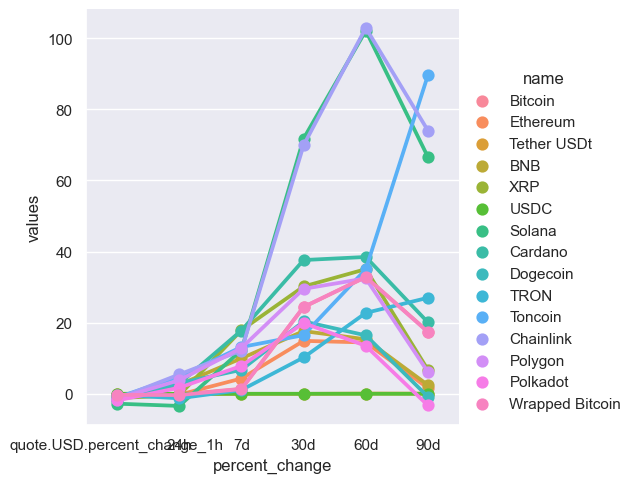
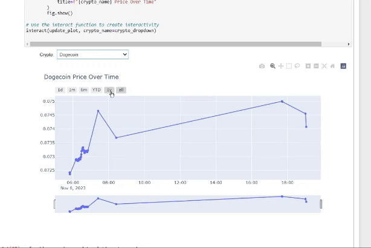
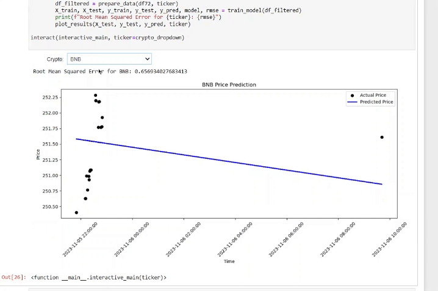
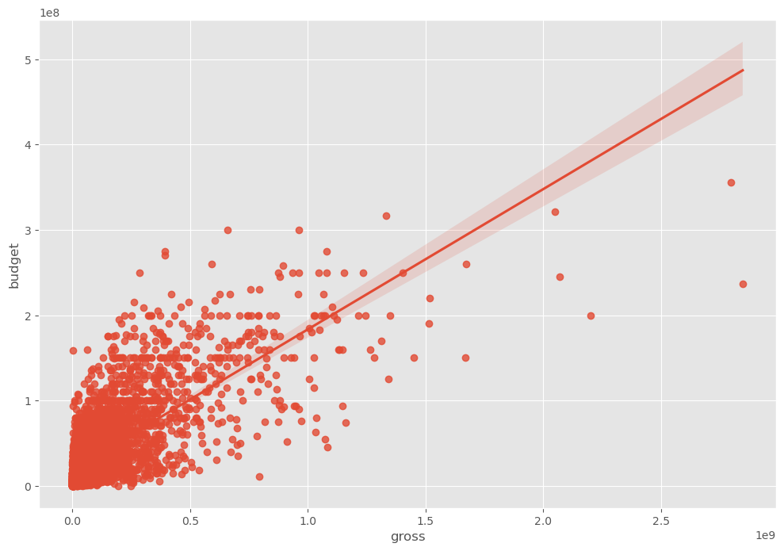
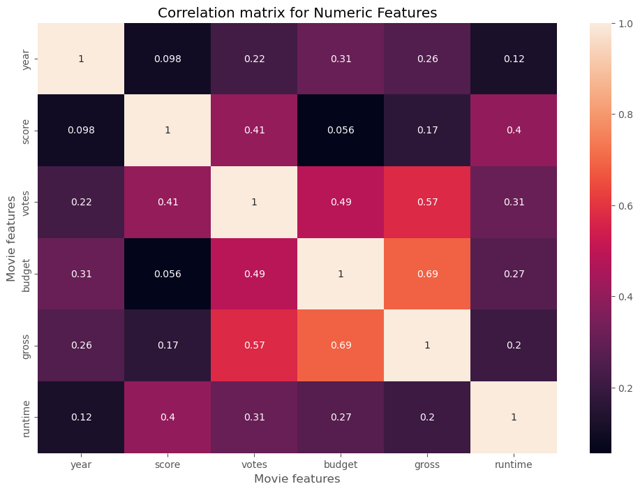
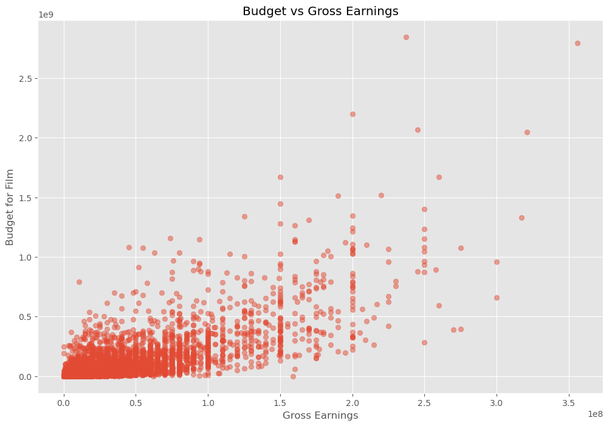
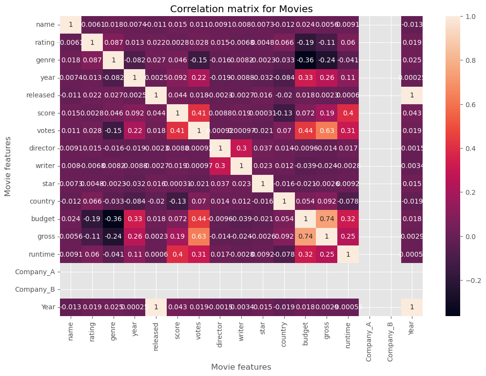

# Data Analysis Projects

# Sources
Inspiration and Tutorial from [Alex the Analyst](https://github.com/AlexTheAnalyst/PortfolioProjects)

# Crypto API Automation Analysis 📈
Features fetching and analyzing cryptocurrency data from the CoinMarketCap API. It is designed to be run periodically to collect the latest cryptocurrency listings and analyze their price trends over time.

### Key Features
- API Interaction: It uses the requests library to interact with the CoinMarketCap Pro API, handling potential connection errors gracefully.
- Data Normalization: Converts the received JSON data into a flattened pandas DataFrame for easier manipulation.
- Data Frame Manipulation: Adjusts display settings to show all DataFrame rows and columns.
- Timestamping: Appends the current timestamp to the DataFrame entries to keep track of data retrieval time.
- Iteration for Data Collection: Implements a loop that calls the api_runner() function 333 times, with a 1-minute pause between calls, to continuously collect data.
- Data Persistence: The code includes commented out sections for saving the data to a CSV file for persistent storage.
- Data Visualization: Uses Seaborn and Matplotlib libraries for plotting the cryptocurrency trends.

### Usage Instructions
- API Key: Replace the placeholder API key with your actual CoinMarketCap API key.
- Running the Script: Execute the script in a Jupyter notebook or other Python environment. Ensure you have a proper internet connection and the required libraries installed.
- Data Rate Limit Configuration: If using Jupyter Notebook, you may need to adjust the IOPub data rate limit as commented in the script.
- Data Analysis: After collecting the data, the script processes and visualizes it to identify trends. The visualization will display the price changes of cryptocurrencies like Bitcoin over time.

### Dependencies
- `requests` for API calls
- `pandas` for data manipulation
- `scikit-learn` for linear regression
- `seaborn`, `matplotlib`, `plotly` for visualization

### Analysis
 

This multi-line chart compares the performance of various cryptocurrencies over different time intervals (1h, 24h, 7d, 30d, 60d, 90d). Each line represents a different cryptocurrency, with distinct colors for easier comparison. This chart is useful for visualizing which cryptocurrencies are more volatile or stable across different timescales.
#### Usage:
To analyze market trends, identify which cryptocurrencies are the most volatile, and observe the general market behavior over time. This can be particularly useful for investors and traders for making informed decisions.

### Interactive Detailed Cryptocurrency Price Movement
 

This interactive line chart allows users to delve into the minute-by-minute price changes of their cryptocurrency of choice on November 6, 2023. Through a user-friendly interface, one can select different cryptocurrencies to analyze their price movements within the detailed timeframe. This graph not only displays the granular price data but also responds to user input, updating the display according to the chosen cryptocurrency ticker.
#### Usage:
For conducting an in-depth micro-analysis of selected cryptocurrency behavior, useful for developing or testing high-frequency trading algorithms. It's also valuable for researchers focused on the market microstructure of various digital assets.

### Interactive Cryptocurrency Price Prediction
  

This interactive chart offers a dynamic comparison between the actual and predicted prices of a user-selected cryptocurrency over a specified timeframe. Users can choose different cryptocurrency tickers from a dropdown menu to view the corresponding data. The actual prices are plotted as black dots, while the predicted trend is shown in blue. The prediction model's trendline adjusts according to the selected cryptocurrency, showcasing its ability to adapt to different market data.
#### Usage:
To interactively evaluate and compare the prediction model's performance across various cryptocurrencies, refining the model's accuracy and making bespoke predictions for the chosen digital asset.

# Movie Industry Analysis 🎬
Analysis of a dataset containing movie industry data. By leveraging powerful libraries like Pandas, NumPy, Seaborn, and Matplotlib, you can explore, visualize, and gain insights into movie trends. Dataset from [Kaggle](https://www.kaggle.com/datasets/danielgrijalvas/movies)

### Key Functionalities
- Data Cleaning: The code checks for missing data, ensuring the robustness of the analyses.
- Data Exploration: It explores data types, which is a necessary step before any data manipulation or analysis.
- Outlier Detection: It includes functionality to detect outliers in the 'gross' revenue of the movies, which can be crucial for accurate statistical analysis.

### Steps to Run the Project:
1. Setup Environment: Ensure that Python is installed on your system and that you have installed the required packages (pandas, numpy, seaborn, and matplotlib).
2. Load Data: Place the movies.csv file in a known directory and adjust the path in the pd.read_csv() function to match where you stored the file.
3. Explore Data: Execute the script to load and explore the dataset using the commands provided.
4. Data Cleaning: The script will loop through each column to check for missing values and print out the percentage of missing data for each attribute.
5. Analyze Data Types: Use print(df.dtypes) to understand the types of data you are dealing with.
6. Visualize Data: Use Matplotlib to create a boxplot, which helps in visualizing outliers in the gross revenue data.

### Enhancements:
- Handling Outliers: Implement methods to handle outliers effectively, either by removing them or by using robust statistical methods.
- Advanced Visualizations: Create more sophisticated visualizations to uncover patterns and relationships in the data.
- Statistical Analysis: Perform statistical tests to validate hypotheses about the dataset.
- Predictive Modeling: Extend the script to include predictive analytics using machine learning libraries like scikit-learn to, for example, predict movie success based on given features.

### Scatter Plot of Budget vs. Gross Earnings
  
Key observations from the scatter plot:
- A concentration of points towards the lower left corner indicates many movies have lower budgets and gross earnings.
- An upward trend suggests a positive relationship between the budget and gross earnings.
- A wide confidence interval around the regression line points to high variability beyond budget considerations.

### Correlation Matrix for Numeric Features
  
Insights from the correlation matrix:
- Budget and gross earnings share a strong positive correlation (0.69).
- Votes and gross earnings are moderately correlated (0.57), implying popular movies tend to earn more.
- Score has a weaker positive correlation with gross earnings (0.17), suggesting that higher ratings do not necessarily predict higher earnings.

### Budget vs. Gross Earnings Scatter Plot
  
Observations from the scatter plot:
- Films with higher budgets often show a trend of higher gross earnings.
- A dense cluster of data points towards the bottom left signifies many films with low budgets and earnings.
- Some films with high earnings don't necessarily have large budgets, implying high profitability is possible without significant investment.
- Outliers are present where films with high budgets don't have high gross earnings, which may point to financial underperformance.

### Correlation Matrix for Movies
  
Key points from the correlation matrix:
- A 0.74 correlation between budget and gross earnings suggests a moderately strong positive relationship.
- The number of votes a movie receives has a significant positive correlation (0.63) with its gross earnings, indicating that more popular movies tend to be higher earners.
- The score has a positive correlation (0.19) with gross earnings, but it is not as predictive of success as budget or votes.
- Runtime shows a notable correlation (0.25) with earnings, hinting that longer movies might earn more, potentially due to being major productions.
- The 'Year' variable does not have a clear correlation, which could imply a data presentation issue or lack of significant correlation.
